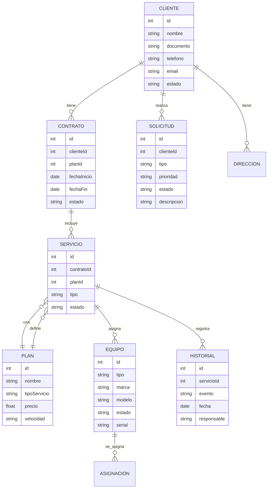
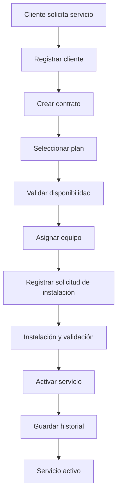
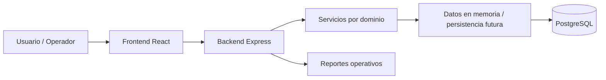

# Diagramas del paso 1

Este archivo contiene los diagramas iniciales del sistema de gestión ISP.

## 1. Diagrama entidad-relación

## 2. Diagrama de flujo de instalación

## 3. Diagrama de arquitectura del sistema

## 4. Resumen funcional por módulo

- Clientes: registro, consulta y seguimiento.
- Contratos: creación, activación y vencimiento.
- Planes: definición de precios y velocidad.
- Equipos: inventario, estado y asignación.
- Solicitudes: instalación, mantenimiento y fallas.
- Reportes: estado operativo y métricas.

## 5. Observación de diseño

La base del sistema está pensada para crecer con PostgreSQL, autenticación JWT y capa de reportes. El objetivo en esta etapa es mantener el modelo simple, trazable y documentado.
